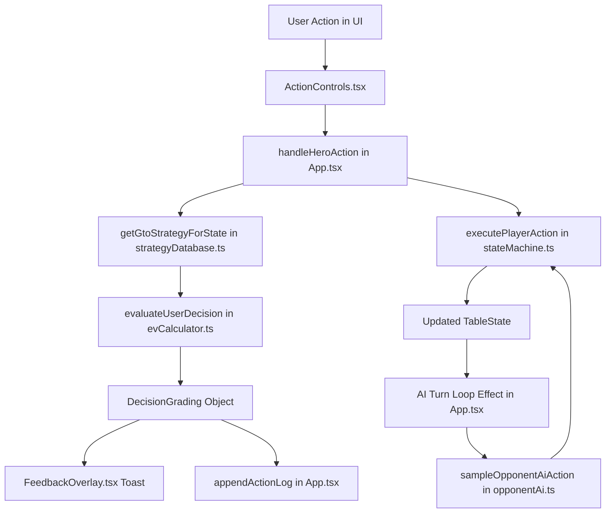

# Poker Trainer — Master Project Handoff Document

**Project:** Poker Trainer (6-Max No-Limit Texas Hold'em GTO Training & Sandbox Application)  
**Corpus / Path:** `c:\Users\Working\Documents\Projects\Poker Trainer`  
**Tech Stack:** React 18, TypeScript, Vite, TailwindCSS (Vanilla CSS Glassmorphism), Lucide React  

---

## 1. Project Overview & Scope

The **Poker Trainer** is a modern, high-performance web application designed to train poker players in GTO (Game Theory Optimal) strategy for 6-max No-Limit Texas Hold'em. It supports three distinct interface difficulty modes (**Simple**, **Grouped**, **Standard**), live decision grading, GTO frequency breakdowns, interactive practice/cheat settings, and diagnostic round logging.

---

## 2. Key Accomplishments Across Conversation History

### A. Preflop & Postflop Bet Sizing Standardization
* **Simple Mode**:
  * **Preflop Open:** Fixed standard 2.5x BB (5 BB for 2 BB blinds). UI label: `RAISE (5 BB)`.
  * **Preflop 3-Bet:** Fixed at 2.5x the open raise (13 BB on a 5 BB open). UI label: `3-BET (13 BB)`.
  * **Postflop Bet:** Set to 33% Pot (e.g., 6 BB on a 20 BB pot), matching the standard postflop GTO default. UI label: `BET 33% POT (6 BB)`.
  * **Postflop Raise:** Fixed at 2.5x the previous bet (15 BB on a 6 BB bet). UI label: `RAISE (15 BB)`.
* **Standard Mode**:
  * **Preflop Presets:** Multiplier-based presets (`2x BB`, `2.5x BB`, `3x BB`, `4x BB`, `ALL-IN` when opening; `2.5x`, `3x`, `3.5x`, `4x`, `ALL-IN` when facing a raise).
  * **Postflop Presets:** Pot-percentage presets (`25% Pot`, `33% Pot`, `50% Pot`, `75% Pot`, `100% Pot`, `133% Pot`, `ALL-IN`).
  * **Interactive Slider:** Dynamic minimum raise enforcer (`2x previous bet` or `1 BB increment`) up to stack maximum. Displays exact BB and contextual secondary unit (`X BB (Y% Pot)` or `X BB (Yx BB)`).

### B. Preflop Pre-Uncalled Card Masking
* **Unrevealed Community Cards:** When a pot is won preflop by everyone folding to a single player, hidden community cards are suppressed/masked so as not to mislead the user about why the hand ended.

### C. Equity Calculation Engine Overhaul (`src/engine/equityCalculator.ts`)
* Replaced unstable/formulaic equity calculations with a centralized deck rollout engine:
  * **Flop & Turn:** Exact deck rollout across all un-dealt card combinations using `evaluate7Cards`.
  * **River & Showdown:** Deterministic 0%, 50%, or 100% equity calculations at showdown.
  * **Diagnostic Logs & Live Overlays:** Integrates exact win probabilities across active and phantom boards into live overlays and downloadable TXT round logs.

### D. GTO Evaluation & Decision Grading Engine (`src/pedagogy/evCalculator.ts`)
* **Preflop Bucket Routing:** Fixed preflop raise grading to route directly to the `raise` bucket instead of using `raiseAmount / potSize` (which previously produced false 200%+ overbet flags preflop).
* **False All-In Detection Fix:** 
  * *Preflop:* Requires `>= 50x BB` (e.g. >=100 BB) to trigger an `All-In` classification, preventing standard 3-bets (like 13-15 BB) from being misclassified as all-in shoves.
  * *Postflop:* Retains `>= 1.8x Pot` threshold for overbets/shoves.
* **Dynamic Action Labels:** Formats user actions dynamically (e.g., `Raise 2.5x BB (5 BB)`, `2.5x Raise (13 BB)`, `Bet 33% Pot (6 BB)`).
* **Strict Strategy Mode:** When enabled, punishes non-optimal mixed GTO plays (forcing pure strategy); when disabled (default), treats all GTO mixed-strategy actions with >5% frequency as valid.

### E. GTO Solver Overlay Mode Filter (`src/components/FeedbackOverlay.tsx`)
* In **Simple Mode**, separate bet-sizing rows (`bet_33`, `bet_75`, `raise`) in the GTO breakdown overlay are merged into a single `Bet / Raise` line (summed frequency, weighted EV average) so the user only sees choices that were actually selectable.

### F. Opponent AI Parity (`src/gto/opponentAi.ts`)
* Restricted AI bet options to strictly mirror human player options for the active `difficultyMode`:
  * *Simple Mode:* AI opens 2.5x BB, 3-bets 2.5x the open, and postflop bets 33% pot.
  * *Standard Mode:* AI samples from the same menu of presets presented to the user.
* AI retains full mixed-GTO probability sampling regardless of Strict Strategy Mode.

### G. State Machine Engine Fixes (`src/engine/stateMachine.ts`)
* **Minimum Raise Floor:** Corrected `minRaise` initialization from `bb * 2` (4 BB) to `bb` (2 BB). Previously, `Math.max(raiseAmount, currentHighBet + minRaise)` forced 2.5x opens (5 BB) up to 6 BB.

### H. Complete Diagnostic Logging & Practice Sandbox
* **Logged Practice Settings:** Real-time round TXT logs track active cheat settings (God Mode, Live Equity Overlays, Forced Hero Cards, Strict Strategy Mode), player hole cards, action histories, EV losses, GTO node keys, and showdown equities.

---

## 3. Comprehensive Codebase Architecture

```
src/
├── App.tsx                      # Master layout, table state coordination, AI turn loop, action handlers, log exporter
├── index.css                    # Tailwind + custom glassmorphic styling tokens and poker animations
├── components/
│   ├── ActionControls.tsx       # Hero decision controls (Simple, Grouped, Standard modes + sizing presets & slider)
│   ├── DiagnosticLogModal.tsx   # Real-time diagnostic viewer & TXT log exporter
│   ├── FeedbackOverlay.tsx      # GTO rating toast & solver frequency breakdown overlay (with mode-filtering)
│   ├── PokerTable.tsx           # Visual 6-max felt table, avatars, chip pots, cards, dealer button
│   └── SandboxModal.tsx         # Practice mode & cheat configuration modal (God Mode, Live Equity, Forced Cards)
├── engine/
│   ├── card.ts                  # Card model, suit/rank constants, deck creation, Fisher-Yates shuffling
│   ├── equityCalculator.ts      # Deck rollout Monte Carlo equity evaluator for active & showdown states
│   ├── evaluator.ts             # 7-card hand strength evaluator (High Card through Straight Flush)
│   ├── simulateAllSettings.ts   # Automated diagnostic simulation suite
│   └── stateMachine.ts          # Core 6-max NL Hold'em state engine, action executor, street transitions, pot distribution
├── gto/
│   ├── opponentAi.ts            # Mode-restricted GTO action sampler for AI opponents
│   └── strategyDatabase.ts      # Preflop RFI/3-bet matrices, canonical hand key mapping, postflop decision node generator
└── pedagogy/
    ├── evCalculator.ts          # Decision grading logic, EV loss computation, dynamic action labeling, leak tracking
    └── gtoScoreEngine.ts        # Overall session analytics, accuracy percentages, grade counters
```

---

## 4. Key Data Flow Summary



---

## 5. Verification Commands

To verify full codebase health:
```bash
npm run build
```
*Result:* 0 errors, successful production bundle compiled in ~9.5s via `tsc && vite build`.

---

## 6. Future Recommendations / Roadmap Ideas

1. **Multi-Street Solver Strategy Trees:** Expand `strategyDatabase.ts` beyond rule-based node generation to full GTO pre-calculated lookup tables (e.g. Solver JSON trees).
2. **Turn/River Specific Sizing Presets:** Add specialized overbet / geometric sizing presets (e.g. 150% pot, 200% pot) in Standard Mode for Turn & River streets.
3. **Hand History Export (HHL / PokerTracker format):** Extend the TXT log exporter to produce standard `.txt` hand histories compatible with PokerTracker 4 / Hold'em Manager.

---

## 7. Latest Implementations & Pending App Changes

### A. River CFR Solver Implementation (`src/engine/cfrSolver.ts`)
* Implemented a real-time Counterfactual Regret Minimization (CFR) engine for the River.
* Uses pre-computed hand equities and a massively parallelized `Float32Array` architecture to solve River scenarios (evaluating all 1,326 possible combos) in under 100ms.
* Currently hard-capped at 20 iterations to prevent blocking the Vite dev server / browser UI thread. 

### B. Static Preflop Engine (`src/gto/preflopCharts.ts`)
* Stripped out the crude heuristic functions and replaced them with a true 100BB 6-Max static chart database.
* Built `parseRangeString` to parse traditional poker shorthand (e.g., `AA-77, AKs-A2s`) into precise 1326-combo frequency grids.
* Covers exact GTO sizings for RFI, vs Open, vs 3-Bet, and vs 4-Bet+ spots.

### C. Pending Desktop App Enhancements (`pending_app_changes.md`)
* I have created a `pending_app_changes.md` file in the root directory. 
* **FUTURE AIs:** Please refer to `pending_app_changes.md` for a comprehensive list of mechanics that were stripped down for the Web prototype (such as Node `fs` dependencies and high-iteration CFR blocking limits) that must be restored when this app is ported to Steam/Electron! Any future down-scaling for the web version should be tracked there.
